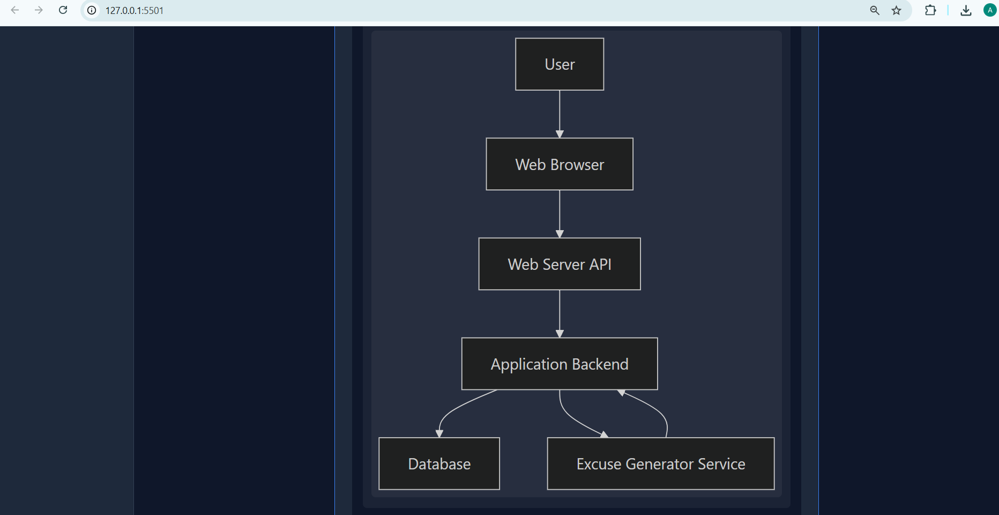

<p align="center">
  
</p>

# idea2infra 🎯

## Basic Details

### Team Name: Quiet pixels

### Team Members
- Member 1: Ann Mary Anilson - College of engineering perumon
- Member 2: Ashly Maria P.S - College of engineering perumon

### Hosted Project Link
 https://tink-her-hack-temp-phi.vercel.app/


### Project Description
idea2infra is an AI-powered Master System Architect designed to help developers and startup founders instantly plan their software infrastructure. By simply inputting an app idea and expected user scale, the system automatically generates a comprehensive architecture blueprint, complete with tech stack recommendations, dynamic visual flowcharts, and interactive cloud cost estimations. It perfectly bridges the gap between a raw concept and a ready-to-build technical foundation.

### The Problem statement
Many beginners and non-technical founders have great software ideas but lack the technical expertise to design the underlying system infrastructure. They struggle to choose the right tech stack, design database schemas, or estimate monthly cloud hosting costs, which significantly delays project development.

### The Solution
idea2infra instantly transforms raw app ideas into professional technical blueprints. By simply typing an app idea and expected user scale, our system uses the Gemini API to generate a professional architecture plan. It visually maps the system using dynamic Mermaid.js flowcharts, provides an interactive AWS/Firebase cost estimator, curates learning resources, and exports a ready-to-code Frontend/Backend boilerplate `.zip` workspace.

---

## Technical Details

### Technologies/Components Used

**For Software:**
- Languages used: HTML5, CSS3, Vanilla JavaScript

- Frameworks used: None (Pure Vanilla implementation for extreme lightweight performance)

- Libraries used: Mermaid.js, html2pdf.js, JSZip, Marked.js

- Tools used: VS Code, Git, GitHub, Google Gemini 2.5 Flash API


**For Hardware:**
  none.this is a web software project

## Features

List the key features of your project:
- Feature 1: Feature 1: AI Architecture Generation: Instantly turns text descriptions into full system blueprints with      strict prompt-injection guardrails.
- Feature 2: Dynamic Flowcharts: Renders Mermaid.js architecture diagrams visually on the screen that scale perfectly for exports.
- Feature 3: Interactive Cost Estimator: Context-aware calculator that estimates monthly cloud hosting budgets based on the AI's recommended tech stack (Enterprise vs BaaS vs Static).
- Feature 4: Boilerplate Exporter & PDF: Single-click download of a ready-to-code Frontend/Backend .zip starter workspace and a pixel-perfect PDF report.

---

## Implementation

### For Software:

#### Installation
# Clone the repository
git clone https://github.com/your-username/tink-her-hack-temp.git

# Navigate to the project directory
cd tink-her-hack-temp

# Add your API Key
# 1. Open src/script.js
# 2. Replace the GEMINI_API_KEY variable with your actual Google Gemini API key


#### Run
# No complex build tools required! 
# Simply open the index.html file in your browser:
open public/index.html

# Alternatively, use VS Code Live Server extension to serve on port 5500

## Project Documentation

### For Software:

#### Screenshots (Add at least 3)


  The idea2infra Input Dashboard and terminal-style loading sequence



The AI-Generated System Architecture and dynamically rendered Mermaid.js Flowchart.

The Interactive Cost Estimator, tailored Learning Hub, and Export Workspace buttons.


## Additional Documentation

### For Web Projects with Backend:

#### API Documentation

**Base URL:** `https://generativelanguage.googleapis.com/v1beta/models/gemini-2.5-flash:generateContent`

*Note: idea2infra operates entirely client-side (serverless). We do not host a custom backend database; instead, we communicate directly with the external Google Gemini API.*

##### Endpoints

**POST /generateContent**
- **Description:** Sends the user's project idea to the Gemini API with strict architecture prompt constraints.
- **Request Body:**
```json
{
  "contents": [{
    "parts": [{
      "text": "Act as a Master System Architect. Generate an architecture for: [User Input]"
    }]
  }]
}
Response:

JSON
{
  "candidates": [{
    "content": {
      "parts": [{
        "text": "### Executive Summary\n[Generated Markdown and Mermaid Code]"
      }]
    }
  }]
}
```


## AI Tools Used (Optional - For Transparency Bonus)
AI Tools Used
Tool Used: Google Gemini

Purpose: Pair-programming assistance, debugging library conflicts, and refining CSS layouts.

Debugging SVG scaling issues with html2pdf.js and Mermaid.js.

Generating the boilerplate code folder structures for the JSZip exporter.

Refining CSS flexbox properties for a responsive dashboard.

### Key Prompts Used:

"How do I force html2canvas to read a Mermaid SVG at 100% width instead of a hardcoded pixel size?"

"Write a JavaScript function using JSZip to create a frontend and backend folder structure with boilerplate code."

"Write a JavaScript function to dynamically scan text for the words 'AWS' or 'Firebase' and change a pricing multiplier."

### Percentage of AI-generated code: Approximately 25%

### Human Contributions:

Core application architecture and feature planning.

Gemini API integration logic and JSON parsing.

Strict prompt-engineering and guardrail implementation.

UI/UX design decisions, color theming, and responsive layout assembly.

### Team Contributions
Ann Mary Anilson: Frontend layout design, UI/UX styling, CSS implementation, responsive DOM manipulation, and project documentation.

Ashly Maria P.S: Gemini API integration, prompt engineering guardrails, PDF generation logic, JSZip boilerplate export feature, and Interactive Cost Estimator logic.

### License
This project is licensed under the MIT License - see the LICENSE file for details.

Made with ❤️ at TinkerHub