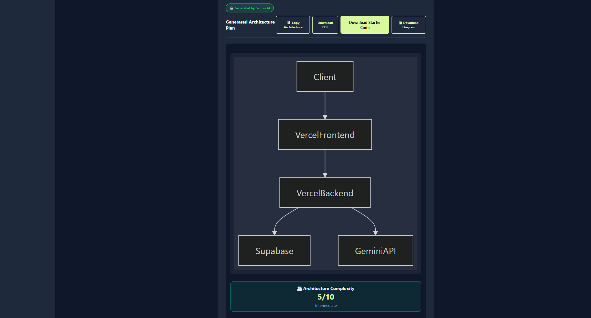
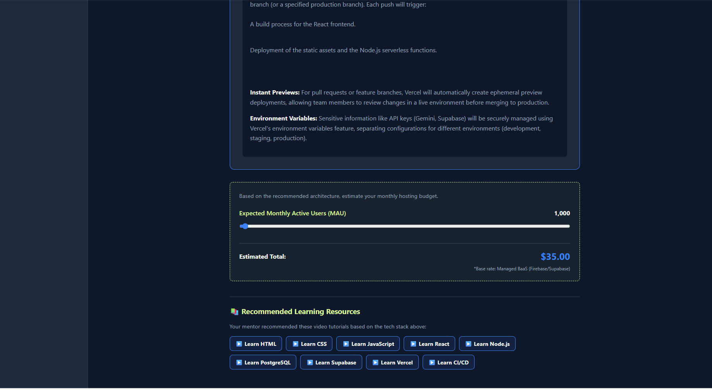
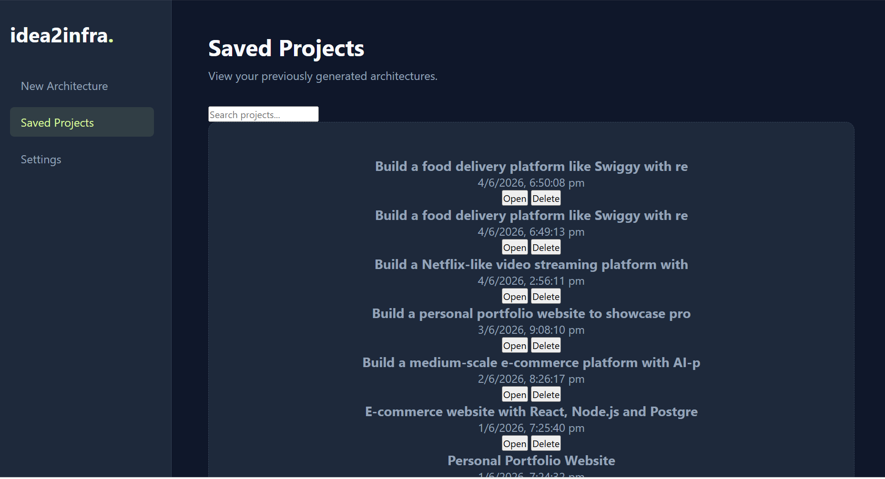
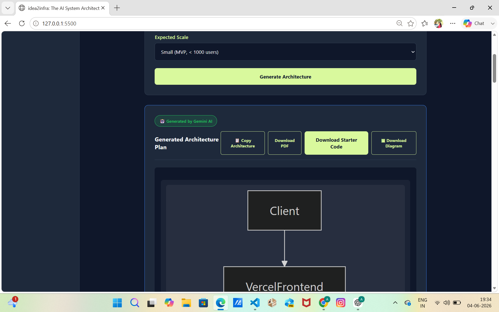

<p align="center">
  
</p>

# idea2infra 🎯

## Basic Details

### Team Name: Quiet pixels

### Team Members
- Member 1: Ann Mary Anilson - College of engineering perumon
- Member 2: Ashly Maria P.S - College of engineering perumon

### Hosted Project Link
 https://tink-her-hack-temp-phi.vercel.app/

### Project Description

idea2infra is a full-stack AI-powered System Architecture Generator designed to help developers, students, and startup founders transform software ideas into professional technical blueprints. By simply entering a project description and expected user scale, users receive architecture recommendations, technology stack suggestions, database planning, API design guidance, scalability strategies, visual architecture diagrams, cost estimations, and learning resources. The platform bridges the gap between an idea and a ready-to-build software solution.

### The Problem Statement

Many students, beginner developers, and non-technical founders have innovative software ideas but lack the experience needed to design scalable system architectures. Choosing the right technologies, planning databases, estimating infrastructure costs, and understanding deployment strategies can be overwhelming and often slow down project development.

### The Solution

idea2infra automates the software architecture planning process using Google Gemini AI and a Flask backend. Users can generate complete architecture blueprints from a simple project idea, visualize system flow using Mermaid.js diagrams, estimate infrastructure costs, explore recommended learning resources, and export results as PDFs, images, or starter project workspaces. The platform also includes saved project management, refresh-state persistence, dark/light theme support, and intelligent fallback architectures when AI services are unavailable.


## Technical Details

### Technologies/Components Used

**For Software:**
Languages:
- HTML5
- CSS3
- JavaScript
- Python

Frameworks:
- Flask

Libraries:
- Mermaid.js
- Marked.js
- DOMPurify
- html2pdf.js
- JSZip

Tools:
- Git
- GitHub
- VS Code
- Google Gemini API
- Vercel
- Render

**For Hardware:**
  None. This is a web-based software project and does not require any dedicated hardware components.
## Features

## Features

idea2infra provides the following capabilities:
- Feature 1: AI-Powered Architecture Generation:

  Generate complete software architecture blueprints from a simple project description and expected user scale using Google Gemini AI.
- Feature 2: Dynamic Architecture Diagrams:

  Automatically renders architecture flowcharts using Mermaid.js for visual understanding of system components.
- Feature 3:Smart Fallback System:

  When Gemini API is unavailable or quota limits are reached, the system automatically provides predefined architecture templates based on project type.

- Feature 4:Saved Projects Management:

  Users can:
    -Save generated architectures automatically
    -Search saved projects
    -Open previously generated architectures
    -Delete saved projects

- Feature 5:Refresh Persistence:

  The application remembers:

    -Current page/tab
    -Opened saved project
    -Theme preference

  Users remain on the same page even after refreshing the browser.
- Feature 6: Interactive Cost Estimator:

  Context-aware calculator that estimates monthly cloud hosting budgets based on the AI's recommended tech stack (Enterprise vs BaaS vs Static).

- Feature 7:Complexity Analyzer:

  Calculates a project complexity score and classifies architectures as Beginner, Intermediate, or Advanced

- Feature 8:Dynamic Learning Hub:

  Suggests learning resources and tutorials for technologies detected in the generated architecture.

- Feature 9: Boilerplate Exporter :
   Single-click download of a ready-to-code Frontend/Backend .zip starter workspace 
- Feature 10:Export Tools:

  Users can:

  -Download architecture reports as PDF
  -Download Mermaid diagrams as PNG
  -Copy generated architectures

- Feature 11:Theme Support:

  Light and Dark mode support with persistent user preference.
- Feature 12:Deployment Ready:

  Frontend hosted on Vercel and backend hosted on Render with REST API communication.
---
## Implementation

### For Software

#### Installation

```bash
# Clone the repository
git clone https://github.com/AshlyMaria98/tink-her-hack-temp.git

# Navigate to the project directory
cd tink-her-hack-temp
```

#### Backend Setup

```bash
# Navigate to backend folder
cd backend

# Create virtual environment
python -m venv venv

# Activate virtual environment

# Windows
venv\Scripts\activate

# Install dependencies
pip install -r requirements.txt
```

Create a `.env` file inside the backend folder:

```env
GEMINI_API_KEY=your_gemini_api_key
```

#### Run Backend

```bash
python app.py
```

Backend will run on:

```text
http://127.0.0.1:5000
```

#### Run Frontend

Open the project root folder in VS Code and start the Live Server extension.

Frontend will run on:

```text
http://127.0.0.1:5500
```

#### Production Deployment

Frontend:

* Vercel

Backend:

* Render

Environment Variables:

* GEMINI_API_KEY

---
## System Architecture

The application follows a client-server architecture:

1. Frontend (HTML/CSS/JavaScript) collects user requirements.
2. Requests are sent to a Flask backend.
3. Flask securely communicates with Gemini AI.
4. Responses are rendered as Markdown and Mermaid diagrams.
5. Projects are stored locally using browser localStorage.
## Project Documentation

### For Software

#### Screenshots


**Idea2Infra Dashboard** – Users enter project requirements and expected scale while viewing the terminal-style AI generation process.



**Generated Architecture Blueprint** – AI-generated architecture recommendations with Mermaid.js visual system diagrams.



**Architecture Analysis Tools** – Interactive cost estimator, complexity score calculator, learning resources, and export features.



**Saved Projects Management** – Search, open, delete, and persist generated architectures across browser refreshes.



**Export & Productivity Features** – Download PDF reports, export diagrams, copy architectures, and generate starter workspace ZIP files.


## Additional Documentation

### For Web Projects with Backend

#### API Documentation

**Frontend URL:**
https://tink-her-hack-temp-phi.vercel.app/

**Backend URL:**
https://idea2infra-backend.onrender.com

*Note: idea2infra now uses a Flask backend as a secure middleware between the frontend and Gemini API. The Gemini API key is stored securely on the backend using environment variables and is never exposed to users.*

### Endpoints

#### POST /generate

**Description:**
Generates a complete system architecture using Gemini AI based on the user's project description and expected scale.

**Request Body**

```json
{
  "description": "Food Delivery App",
  "scale": "Small (MVP, <1000 users)"
}
```

**Success Response**

```json
{
  "success": true,
  "response": "### Executive Summary..."
}
```

**Fallback Response**

```json
{
  "success": true,
  "fallback": true,
  "response": "Cached architecture template..."
}
```

---

#### POST /fallback

**Description:**
Returns a predefined architecture template when Gemini AI is unavailable or quota limits are reached.

**Request Body**

```json
{
  "description": "Chat Application"
}
```

**Response**

```json
{
  "success": true,
  "fallback": true,
  "response": "Fallback architecture content..."
}
```

---

### State Persistence

idea2infra uses browser localStorage to preserve:

* Saved architecture projects
* Theme preferences (Light/Dark Mode)
* Last active page/tab
* Opened saved project state

This ensures users can refresh the browser and continue from the same page without losing their work.

## AI Tools Used (Optional - For Transparency Bonus)

### AI Tools Used

**Tool Used:** Google Gemini, ChatGPT, Claude

### Purpose

AI tools were used as development assistants for:

- Backend development using Flask
- Gemini API integration and debugging
- Prompt engineering and architecture generation logic
- Mermaid.js diagram rendering improvements
- PDF export and JSZip workspace export features
- Saved Projects persistence and refresh-state restoration
- Fallback architecture system implementation
- UI/UX refinements and responsive design improvements
- Deployment troubleshooting for Vercel and Render

### Key Prompts Used

- "Design a scalable system architecture generator using Gemini API."
- "Create a Flask backend endpoint to securely handle Gemini API requests."
- "Generate Mermaid.js architecture diagrams from AI responses."
- "Implement localStorage-based saved projects with open, search, and delete functionality."
- "Restore application state after page refresh using localStorage."
- "Generate downloadable PDF reports and starter code workspaces."
- "Debug deployment issues between Vercel frontend and Render backend."

### Percentage of AI-generated Code

Approximately 30–45%

### Human Contributions

- Overall project planning and feature selection
- UI/UX design decisions
- System architecture prompt design and validation logic
- Feature integration and testing
- Backend deployment and environment configuration
- Saved project workflow design
- Application state persistence logic
- Documentation preparation and project presentation

### Team Contributions

**Ann Mary Anilson**
- Frontend UI design and styling
- CSS implementation and responsive layouts
- User experience improvements
- Frontend integration with Gemini-powered architecture generation
- Learning Resources Hub
- Documentation and project presentation support
- Testing and validation
- System integration and debugging


**Ashly Maria P.S**
- Flask backend development
- Prompt engineering and guardrail implementation
- Mermaid.js diagram rendering
- Saved Projects system
- Refresh-state persistence
- PDF export functionality
- JSZip workspace exporter
- Cost Estimator and Complexity Analyzer
- Deployment on Vercel and Render


### License

This project is licensed under the MIT License - see the LICENSE file for details.

Made with ❤️ by Team Quiet Pixels.